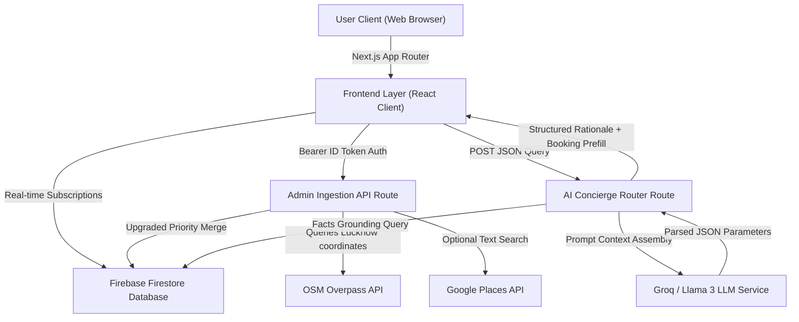
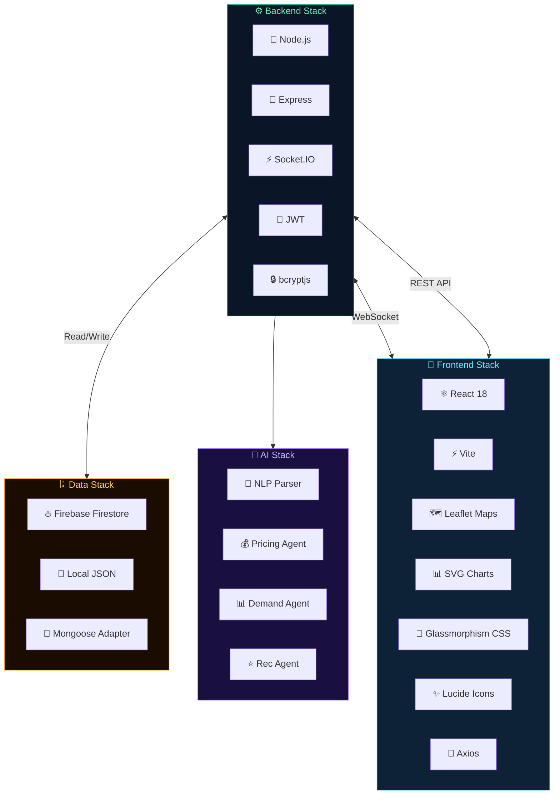
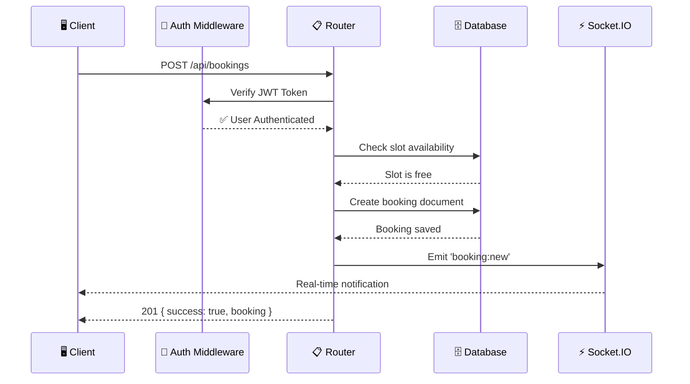
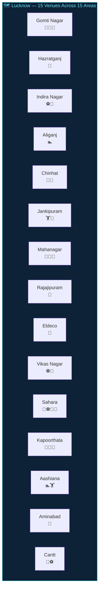
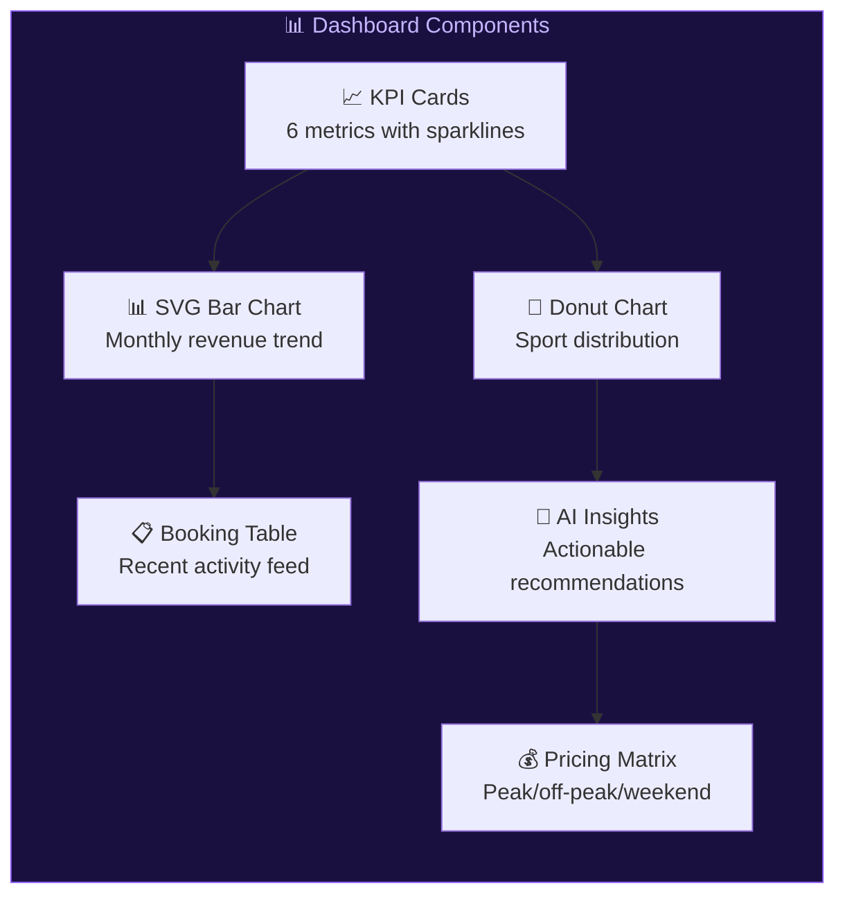
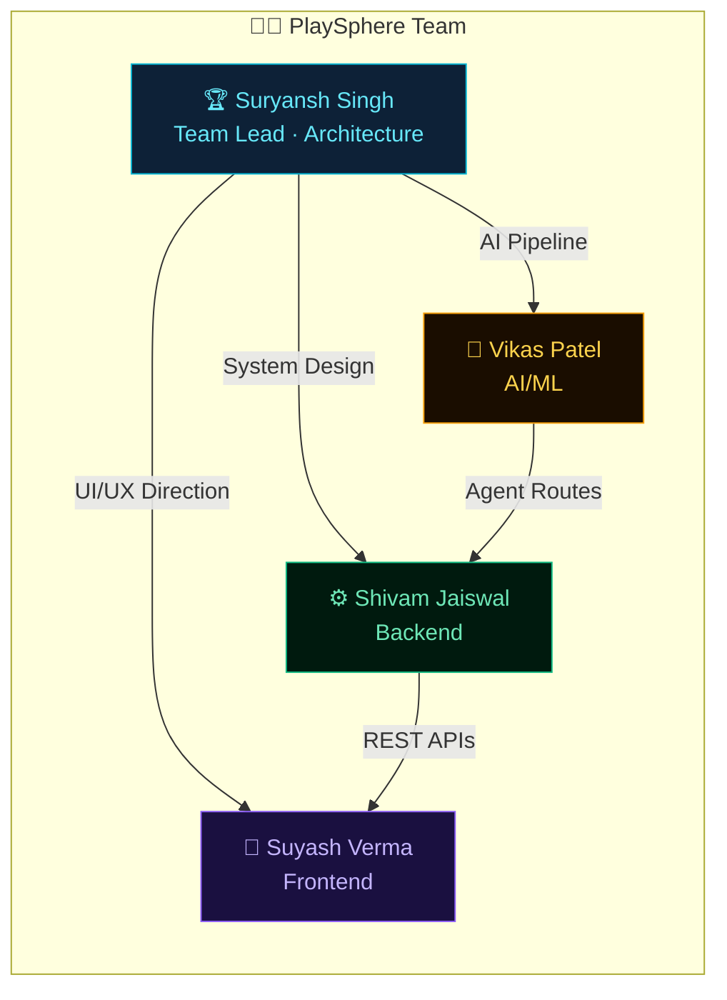
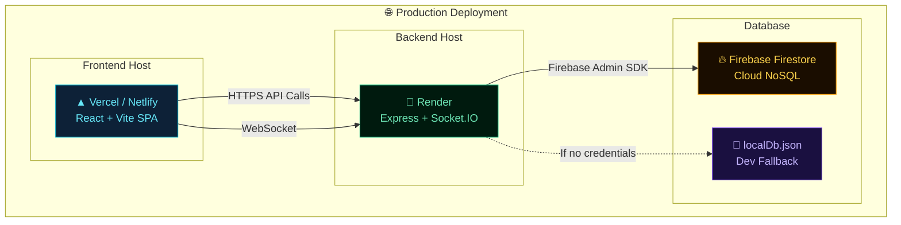

<p align="center">

</p>

<h1 align="center">🏟️ PlaySphere</h1>
<h3 align="center">Agentic AI Sports Infrastructure Discovery & Booking Platform</h3>

<p align="center">
<strong>Your Intelligent Sports Copilot — Find, Compare & Book Courts Using Natural Language</strong>
</p>

[](https://github.com/devvikax/playsphere-ai)
[](https://nextjs.org/)
[](https://react.dev/)
[](https://firebase.google.com/)
[](https://www.typescriptlang.org/)
[](https://developers.google.com/maps)
[](#ai-integration--intelligence-layer)

---

PlaySphere AI is a premium sports-tech and geographic intelligence platform specifically built for the Lucknow region to bridge the gap between fragmented sports facilities, venue owners, and players. By utilizing a hybrid real-time discovery engine (OpenStreetMap + Seed Ingestion + optional Google Places enrichment), a locality-aware grounded AI Concierge, and a secure Neo-Brutalist booking engine, PlaySphere AI delivers an end-to-end marketplace experience ready for Lucknow's growing sports community.

<p align="center">
  <a href="#-problem-statement">Problem</a> •
  <a href="#-solution-overview">Solution</a> •
  <a href="#-architecture">Architecture</a> •
  <a href="#-ai-agent-workflow">AI Agents</a> •
  <a href="#-features">Features</a> •
  <a href="#-tech-stack">Tech Stack</a> •
  <a href="#-database-design">Database</a> •
  <a href="#-api-documentation">API Docs</a> •
  <a href="#-installation">Installation</a> •
  <a href="#-demo-credentials">Demo</a>
</p>

---

## 🎯 Problem Statement

Organizing a game of football, badminton, or cricket is a **fragmented, frustrating experience**:

---

## 💡 Solution Overview

PlaySphere AI addresses these regional gaps by introducing a secure, map-integrated, and AI-grounded sports venue ecosystem.

*   **Hybrid Real-Time Ingestion**: Admins can trigger an automated crawler that queries the OpenStreetMap (OSM) Overpass API within Lucknow's coordinates to discover stadiums, halls, and pitches, filtering out invalid records and classifying sports automatically.
*   **Locality-Aware Proximity AI**: A conversational assistant parses live Firestore data to recommend sports slots based on the user's distance and budget. The AI concierge applies proximity boosts so that matches closest to neighborhoods like Gomti Nagar or Hazratganj are prioritized.
*   **Marketplace & Ownership Verification**: Discovered infrastructure is kept read-only and unbookable. Venue owners must register, submit verification credentials (payment details, UPI IDs, UTR records), and claim their venue. Once approved by an Admin, the venue opens for bookings.
*   **Simulated Real-Time Bookings**: Players check real-time court availability, book morning/afternoon/evening slots, submit simulated transaction UPI numbers (UTR), and generate active tickets, keeping the marketplace secure and fully verified.


---

## ✨ Features

### 🏃 Player Features
*   **Tactile Venue Discovery**: Multi-faceted filtering by sport type, area, price range, availability, and facility type.
*   **Google Maps Navigation**: Visual map pins indicating venue locations, matching colors by sport type, and supporting gesture-cooperative scrolling.
*   **Grounded AI Concierge**: natural language discovery query engine (e.g. *"Find a football turf in Aliganj under 500 rupees"*).
*   **Ticket Dashboard**: Modern ticket viewer featuring automated ID codes (`PS-XXXX-XXXX`), dynamic status badges, and manual booking cancellations.
*   **Tac-Light Theme Switcher**: Instant zero-flash theme transitions between a dark sports arena aesthetic and a warm cream Light mode.

### 🏢 Owner Features
*   **Claim/Verification Requests**: Secure, formal venue claim portal for linking public infrastructure to authenticated owner profiles.
*   **Venue Management Console**: Configure pricing, upload pictures, list amenities, and toggle real-time slot availability.
*   **Active Bookings Checklist**: Interface to track reservations, review player UTR codes, approve payments, and log bookings.
*   **Tactile Revenue Analytics**: Real-time business metrics tracking Confirmation Rate, Revenue, and Venue Activity Ratios.

### 👮 Admin Features
*   **Auto-Ingestion Pipeline**: Core interface to launch the hybrid scanner for municipal and private sports facility discovery.
*   **Ingestion Telemetry Dashboard**: Visual 4x2 grid of counters tracking OSM Raw Fetched, Valid Normalized, Rejected Junk, Added, Updated, Skipped, Enriched, and Ingestion Errors.
*   **Log Console Terminal**: Live-scrolling logs showing the source (Seed, OSM, or Enriched) and duplicate status of every venue processed.
*   **Central approvals queue**: Approve/Reject owner registration claims and monitor the system lock configuration.

### 🧠 AI Features
*   **Booking Prefill Orchestration**: The AI Concierge extracts parameters (venue name, sport, date, time slot) from the chat conversation and builds a prefilled booking drawer, reducing reservations to a single click.
*   **Sports Rules Guidance**: Conversational fallback mode that provides lightweight tips and gear lists while strictly restricting advice to sports.


---

## 📐 System Architecture

PlaySphere AI is designed as a decentralized client-server web app backed by direct Cloud Firestore real-time subscriptions and serverless API endpoints.



### Data Flow
1.  **Discovery**: Admin triggers `/api/admin/discover-infrastructure`. The server crawls Lucknow's coordinate bounding box using the OpenStreetMap Overpass API, filters out junk (empty names, invalid coordinates), performs optional Google Places metadata enrichment, and saves them to Firestore under `source: osm_discovered` (unbookable).
2.  **Claiming**: An Owner registers, submits a claim request with verification documents. Admin reviews and approves the claim. The venue's state changes to `ownerLinked: true, bookable: true`.
3.  **Booking**: A Player searches, selects a slot, and makes a booking. The booking state is written to Firestore, instantly syncing with the Owner's dashboard via real-time hooks.

---

## 🛠️ Tech Stack

| Layer | Technology | Purpose |
| :--- | :--- | :--- |
| **Frontend** | React 18 + Vite | Component-based SPA with hot module replacement |
| **Routing** | React Router DOM v6 | Client-side navigation with protected routes |
| **Maps** | Leaflet + React Leaflet | Interactive dark-themed map with CartoDB tiles |
| **Charts** | Inline SVG | Zero-dependency bar charts, donut charts, sparkline trends |
| **Icons** | Lucide React | Premium icon library (350+ icons) |
| **HTTP Client** | Axios | API communication with interceptors |
| **Styling** | Vanilla CSS | Custom design system with CSS variables, glassmorphism, animations |
| **Backend** | Node.js + Express | RESTful API server with middleware architecture |
| **Database** | Firebase Firestore / Local JSON | Cloud-native document storage with local fallback |
| **DB Adapter** | Custom Mongoose Mock | Mongoose-compatible API for seamless model usage |
| **Auth** | JWT + bcryptjs | Stateless authentication with password hashing |
| **Real-Time** | Socket.IO | Bidirectional WebSocket communication |
| **AI Engine** | Custom NLP Parser | Rule-based intent extraction for sports queries |

### Tech Stack Visualization



---

## 📂 Project Structure

```
PlaySphere/
│
├── backend/                          # ⚙️ Express API Server
│   ├── config/
│   │   ├── db.js                     # Database connection initializer
│   │   └── mongooseMock.js           # 🔥 Mongoose→Firebase/JSON adapter (800+ lines)
│   ├── middleware/
│   │   └── authMiddleware.js         # JWT verification + role authorization
│   ├── models/
│   │   ├── User.js                   # User schema (bcrypt hashing, roles, preferences)
│   │   ├── Venue.js                  # Venue schema (GeoJSON, sports config, amenities)
│   │   ├── Booking.js                # Booking schema (conflict detection, pricing)
│   │   └── Review.js                 # Review schema (star ratings, auto avg calculation)
│   ├── routes/
│   │   ├── authRoutes.js             # Register, Login, Profile endpoints
│   │   ├── venueRoutes.js            # CRUD + geospatial search + slot availability
│   │   ├── bookingRoutes.js          # Create, list, cancel bookings
│   │   ├── aiRoutes.js               # 🤖 AI Copilot chat + recommendations + pricing
│   │   └── analyticsRoutes.js        # Dashboard stats, heatmap data, platform metrics
│   ├── seed/
│   │   └── seedData.js               # 15 Lucknow venues, 5 users, 30 bookings, reviews
│   ├── localDb.json                  # 📁 Auto-generated local database (fallback)
│   ├── server.js                     # App bootstrap, Socket.IO, middleware, error handling
│   ├── .env.example                  # Environment variable template
│   └── package.json
│
├── frontend/                         # 🖥️ React + Vite Client
│   ├── public/
│   │   └── favicon.svg               # PlaySphere gradient favicon
│   ├── src/
│   │   ├── components/
│   │   │   ├── Navbar.jsx            # Glassmorphism header with mobile drawer
│   │   │   ├── Footer.jsx            # 🦶 Multi-column footer with social & feature badges
│   │   │   ├── MapView.jsx           # Leaflet dark map with custom DivIcon markers
│   │   │   ├── VenueCard.jsx         # Glass card with sports tags, ratings, pricing
│   │   │   ├── BookingModal.jsx      # Slot grid picker, date selector, price calculator
│   │   │   ├── AIChatbot.jsx         # 🤖 Floating AI chat with suggestion prompts
│   │   │   ├── StatsCard.jsx         # Animated counter with gradient values
│   │   │   └── FeatureCard.jsx       # Feature showcase with hover glow effects
│   │   ├── pages/
│   │   │   ├── Home.jsx              # Hero section, stats, features, CTA
│   │   │   ├── Explore.jsx           # Split layout: filters + map + venue grid
│   │   │   ├── VenueDetail.jsx       # Sport tabs, amenities, reviews, mini-map
│   │   │   ├── Bookings.jsx          # Upcoming/past tabs with cancel actions
│   │   │   ├── Dashboard.jsx         # 📊 Enhanced: SVG charts, donut, sparklines, AI insights
│   │   │   └── Auth.jsx              # Login/Register with role selection + demo buttons
│   │   ├── App.jsx                   # Route definitions + AuthContext + Footer
│   │   ├── index.css                 # 🎨 Complete design system (600+ lines)
│   │   └── main.jsx                  # React root with BrowserRouter
│   ├── index.html                    # SEO tags, Google Fonts, Leaflet CSS
│   ├── vite.config.js                # API proxy to backend
│   └── package.json
│
├── .gitignore
└── README.md                         # 📖 This file
```

---

## 📋 API Documentation

### 🔐 Authentication (`/api/auth`)

| Method | Endpoint | Access | Description |
| :--- | :--- | :--- | :--- |
| `POST` | `/register` | Public | Create new account (Player or Venue Owner) |
| `POST` | `/login` | Public | Authenticate and receive JWT token |
| `GET` | `/me` | Private | Get current user profile |

### 🏟️ Venues (`/api/venues`)

| Method | Endpoint | Access | Description |
| :--- | :--- | :--- | :--- |
| `GET` | `/` | Public | List venues with filters (`sport`, `area`, `minPrice`, `maxPrice`, `minRating`, `sort`) |
| `GET` | `/nearby?lat=&lng=&radius=` | Public | Geospatial proximity search |
| `GET` | `/:id` | Public | Venue detail with reviews |
| `GET` | `/:id/slots?date=&sport=` | Public | Available time slots for a specific date |
| `POST` | `/` | Owner | Create new venue |
| `PUT` | `/:id` | Owner | Update venue details |
| `POST` | `/:id/reviews` | Private | Submit star rating and comment |

### 📅 Bookings (`/api/bookings`)

| Method | Endpoint | Access | Description |
| :--- | :--- | :--- | :--- |
| `POST` | `/` | Private | Reserve a court slot (conflict detection included) |
| `GET` | `/my` | Private | Get user's booking history |
| `PUT` | `/:id/cancel` | Private | Cancel booking and trigger refund |
| `GET` | `/venue/:venueId` | Owner | View bookings for owned venue |

### 🤖 AI Agents (`/api/ai`)

| Method | Endpoint | Access | Description |
| :--- | :--- | :--- | :--- |
| `POST` | `/chat` | Private | **AI Sports Copilot** — natural language venue search + booking |
| `GET` | `/recommendations` | Private | Personalized venue suggestions based on user preferences |
| `GET` | `/demand-prediction` | Public | Trending sports, peak hours, busiest days |
| `GET` | `/dynamic-pricing/:venueId` | Owner | AI pricing matrix (peak, off-peak, weekend, rainy day) |

### 📊 Analytics (`/api/analytics`)

| Method | Endpoint | Access | Description |
| :--- | :--- | :--- | :--- |
| `GET` | `/dashboard` | Owner | Revenue, bookings, ratings, AI booking share, monthly trends |
| `GET` | `/heatmap` | Public | Venue coordinates with crowd density for map overlay |
| `GET` | `/stats` | Public | Platform-wide aggregate statistics |

### API Request Flow



---

## 🚀 Installation

### Prerequisites

- **Node.js** (v18+) — [Download](https://nodejs.org/)
- **Firebase** (optional) — [Firebase Console](https://console.firebase.google.com/)
  - The app works **without Firebase** using a local JSON database fallback

### Step 1: Clone the Repository

```bash
git clone https://github.com/your-username/PlaySphere.git
cd PlaySphere
```

### Step 2: Configure Backend Environment

```bash
cd backend
cp .env.example .env
```

Edit `.env` with your configuration:

```env
PORT=5000
JWT_SECRET=your_secure_secret_key
JWT_EXPIRE=30d
CLIENT_URL=http://localhost:5173

# Firebase Configuration (leave blank to use local JSON database)
FIREBASE_PROJECT_ID=
FIREBASE_CLIENT_EMAIL=
FIREBASE_PRIVATE_KEY=
```

> 💡 **No Firebase?** That's fine! Leave the Firebase fields blank and PlaySphere will use `localDb.json` automatically.

### Step 3: Install & Seed Backend

```bash
npm install
npm run seed        # Seeds 15 Lucknow venues, 5 users, 30 bookings, reviews
npm run dev         # Starts Express server on port 5000
```

Expected seed output:
```
⚠️  Firebase credentials not provided. Falling back to local JSON Database
✨ PlaySphere Database Adapter Loaded (Firebase Firestore / Local Fallback Active)
🌱 Starting PlaySphere database seed...
🗑️  Cleared existing data
✅ Created 5 users
✅ Created 15 venues in Lucknow
✅ Created 12 reviews
✅ Created 30 sample bookings

═══════════════════════════════════════════
🎉 PlaySphere seed complete!

📋 Demo Credentials:
   Admin:       admin@playsphere.in       / admin123
   Venue Owner: rahul@playsphere.in       / password123
   Player:      arjun@playsphere.in       / password123
═══════════════════════════════════════════
```

### Step 4: Install & Run Frontend

Open a **new terminal**:

```bash
cd frontend
npm install
npm run dev         # Starts Vite dev server on port 5173
```

### Step 5: Open in Browser

Navigate to **[http://localhost:5173](http://localhost:5173)** 🚀

---

## 🔑 Demo Credentials

| Role | Email | Password | Access |
| :--- | :--- | :--- | :--- |
| 🏃 **Player** | `arjun@playsphere.in` | `password123` | Explore, Book, AI Chat, Reviews |
| 🏢 **Venue Owner** | `rahul@playsphere.in` | `password123` | Dashboard, Analytics, Pricing |
| 🛡️ **Admin** | `admin@playsphere.in` | `admin123` | Full platform access |

---

## 🗺️ Seeded Venues (Lucknow)

The database ships with **15 premium sports venues** across Lucknow:

| # | Venue | Area | Sports | Rating |
| :--- | :--- | :--- | :--- | :--- |
| 1 | Gomti Nagar Sports Arena | Gomti Nagar | Badminton, Table Tennis, Squash | ⭐ 4.7 |
| 2 | Hazratganj Cricket Ground | Hazratganj | Cricket | ⭐ 4.5 |
| 3 | Indira Nagar Football Hub | Indira Nagar | Football, Volleyball | ⭐ 4.8 |
| 4 | Aliganj Aquatic Centre | Aliganj | Swimming | ⭐ 4.6 |
| 5 | Chinhat Tennis Club | Chinhat | Tennis, Badminton | ⭐ 4.4 |
| 6 | Jankipuram Fitness Hub | Jankipuram | Gym, Basketball | ⭐ 4.3 |
| 7 | Mahanagar Multi-Sports | Mahanagar | Badminton, TT, Volleyball | ⭐ 4.5 |
| 8 | Rajajipuram Cricket Academy | Rajajipuram | Cricket | ⭐ 4.6 |
| 9 | Eldeco Badminton Academy | Eldeco | Badminton | ⭐ 4.9 |
| 10 | Vikas Nagar Arena | Vikas Nagar | Football, Basketball | ⭐ 4.2 |
| 11 | Sahara Sports Village | Sahara | Cricket, Football, Squash, Tennis | ⭐ 4.7 |
| 12 | Kapoorthala Racket Club | Kapoorthala | Squash, TT, Badminton | ⭐ 4.4 |
| 13 | Aashiana Swimming & Wellness | Aashiana | Swimming, Gym | ⭐ 4.5 |
| 14 | Aminabad Basketball Court | Aminabad | Basketball | ⭐ 4.1 |
| 15 | Cantt Sports Ground | Cantt | Cricket, Football | ⭐ 4.6 |

### Venue Coverage Map



---

## 📊 Dashboard Features

The **Owner Dashboard** provides comprehensive business intelligence through interactive visualizations:



| Component | Description |
| :--- | :--- |
| **KPI Stat Cards** | My Arenas, Total Revenue (with sparkline), Total Bookings, AI Booked %, Avg Rating, Today's Bookings |
| **SVG Bar Chart** | Gradient bars with grid lines, value labels, month labels, booking counts — zero external dependencies |
| **Donut Chart** | Sport-wise booking distribution with colored segments, glow filters, legend with counts and percentages |
| **Tab Navigation** | Overview / Revenue / Sports / AI Pricing — organized content sections |
| **AI Insights** | Weekend surge alerts, peak hour warnings, off-peak opportunities, AI adoption gap tracking |
| **Revenue Breakdown** | Monthly table with per-booking averages, revenue share bars, MoM growth indicators |
| **Booking Feed** | Recent bookings with user info, venue, sport badge, date/time, status, amount, and AI/Manual source badge |

---

## 🔮 Future Scope

| Feature | Description |
| :--- | :--- |
| 📱 **React Native App** | Cross-platform mobile app with push notifications |
| 💳 **Razorpay Payments** | Integrated payment gateway with auto-refunds |
| 🤖 **LLM Integration** | OpenAI/Gemini-powered natural language understanding |
| 👥 **AI Matchmaking** | Find nearby players for team sports |
| 🏆 **Tournament Engine** | Auto-generate brackets, fixtures, and leaderboards |
| 📊 **Advanced Analytics** | Predictive demand modeling with ML pipelines |
| 💬 **WhatsApp Bot** | Book venues via WhatsApp conversational interface |
| 🔊 **Voice Assistant** | Speech-to-text venue search and booking |
| 🌦️ **Weather Integration** | Auto-apply rainy day discounts using live weather APIs |
| 📍 **Multi-City Expansion** | Scale beyond Lucknow to Delhi, Bangalore, Mumbai |

---

## 👨‍💻 Team — PlaySphere

<table>
  <tr>
    <td align="center" width="250">
      <a href="https://github.com/suryanshsingh07">
        
      </a>
      <br />
      <strong>Suryansh Singh</strong>
      <br />
      <sub>🏆 Team Leader · Full-Stack · Architecture</sub>
      <br />
      <sub>Project vision, system design, AI agent pipeline, database architecture, and integration lead</sub>
    </td>
    <td align="center" width="250">
      <a href="https://github.com/shivam5802">
        
      </a>
      <br />
      <strong>Shivam Jaiswal</strong>
      <br />
      <sub>🎨 Frontend Developer</sub>
      <br />
      <sub>React UI components, glassmorphism design system, Leaflet map integration, responsive layouts</sub>
    </td>
  </tr>
  <tr>
    <td align="center" width="250">
      <a href="https://github.com/suyashverma0">
        
      </a>
      <br />
      <strong>Suyash Verma</strong>
      <br />
      <sub>⚙️ Backend Developer</sub>
      <br />
      <sub>Express API routes, JWT auth middleware, Socket.IO real-time engine, booking conflict logic</sub>
    </td>
    <td align="center" width="250">
      <a href="https://github.com/devvikax">
        
      </a>
      <br />
      <strong>Vikas Patel</strong>
      <br />
      <sub>🤖 AI/ML Engineer</sub>
      <br />
      <sub>NLP intent parser, recommendation agent, dynamic pricing engine, demand prediction algorithms</sub>
    </td>
  </tr>
</table>

### Team Workflow



---

## 🌐 Deployment Guide

### Live Production Links

The production version of the app is live and fully accessible at:
- ⚡ **Primary Frontend (Vercel):** [https://aiplaysphere.vercel.app/](https://aiplaysphere.vercel.app/)
- ⚡ **Mirror Frontend (Netlify):** [https://aiplaysphere.netlify.app/](https://aiplaysphere.netlify.app/)
- 🚀 **Live Backend (Render):** [https://playsphere-y1sa.onrender.com](https://playsphere-y1sa.onrender.com)

### Frontend — Vercel / Netlify

The React frontend can be deployed to **Vercel** or **Netlify** with SPA routing support:

```bash
cd frontend
npm run build          # Produces dist/ folder
```

**Vercel**: Connect your GitHub repo → Set root directory to `frontend` → Framework: Vite → Deploy.

**Netlify**: Connect your GitHub repo → Set build directory to `frontend/dist` → Build command: `cd frontend && npm run build`.

> ⚠️ Set the environment variable `VITE_API_URL` to your Render backend URL (e.g. `https://playsphere-y1sa.onrender.com`).


### Backend — Render

Deploy the Express API server to **Render**:

1. Create a new **Web Service** on [Render](https://render.com)
2. Connect your GitHub repository
3. Set **Root Directory** to `backend`
4. Set **Build Command** to `npm install`
5. Set **Start Command** to `node server.js`
6. Add Environment Variables:

```env
PORT=5000
JWT_SECRET=your_secure_secret_key
JWT_EXPIRE=30d
CLIENT_URL=https://your-frontend-url.vercel.app
FIREBASE_PROJECT_ID=        # Optional
FIREBASE_CLIENT_EMAIL=      # Optional
FIREBASE_PRIVATE_KEY=       # Optional
```

### Deployment Architecture



---

## 👥 Contributing

1. Fork the repository
2. Create your feature branch (`git checkout -b feature/ai-matchmaking`)
3. Commit changes (`git commit -m 'Add AI matchmaking agent'`)
4. Push to the branch (`git push origin feature/ai-matchmaking`)
5. Open a Pull Request

---

## 📄 License

Distributed under the **MIT License**. See `LICENSE` for details.

---

<p align="center">
  
  
  
</p>

<p align="center">
  <strong>🏟️ PlaySphere — Where AI Meets the Arena</strong>
</p>

<p align="center">
  <sub>
    Built with ❤️ by <strong>Team PlaySphere</strong> for the <strong>Agentic Premier League Hackathon 2026</strong><br/>
    <a href="https://github.com/suryanshsingh07">Suryansh Singh</a> · <a href="https://github.com/shivam5802">Shivam Jaiswal</a> · <a href="https://github.com/suyashverma0">Suyash Verma</a> · <a href="https://github.com/devvikax">Vikas Patel</a><br/><br/>
    React 18 · Node.js · Firebase · Socket.IO · Custom AI Agents · SVG Charts · Glassmorphism UI
  </sub>
</p>

<p align="center">
  <sub>
    ⭐ Star this repo if you find it useful! ⭐
  </sub>
</p>
